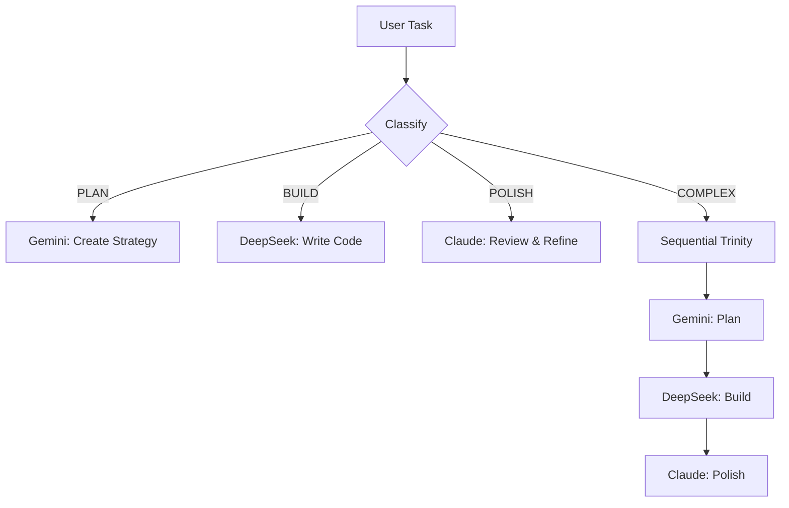

# 🔱 Skill: TRINITY_ORCHESTRATOR
**Class**: `Meta / Automation`
**Purpose**: Automatically route tasks across Gemini, DeepSeek, and Claude for optimal multi-agent collaboration.

## 📜 Description
The ultimate evolution of the Trinity Protocol - a script that analyzes any task, automatically determines which AI model should handle it, delegates the work, and combines results into a final output.

## 🛠️ Tech Stack
-   **API Gateway**: OpenRouter (unified access to all models)
-   **Models**: 
    - `google/gemini-2.0-flash-thinking-exp` (Planning)
    - `deepseek/deepseek-r1` (Execution)
    - `anthropic/claude-3.5-sonnet` (Polish)
-   **Orchestration**: Node.js script with task classification

## ⚡ Protocol

### Task Classification
The orchestrator analyzes the input and classifies it as:

**Type 1: PLAN** → Route to Gemini
- Keywords: "how should", "design", "architecture", "approach", "plan"
- Examples: "How should I structure the auth system?"

**Type 2: BUILD** → Route to DeepSeek  
- Keywords: "implement", "build", "create", "write code", "add feature"
- Examples: "Build a settings page with export functionality"

**Type 3: POLISH** → Route to Claude
- Keywords: "review", "improve", "document", "refactor", "explain"
- Examples: "Review this code and add documentation"

**Type 4: COMPLEX** → Multi-Step Trinity
- Requires all three: Plan → Build → Polish
- Examples: "Build a new authentication system from scratch"

### Execution Flow



## 🧬 Usage

```bash
# Basic usage
node scripts/trinity.mjs "Build a habit tracking dashboard"

# Force specific mode
node scripts/trinity.mjs --mode=plan "Authentication strategy"
node scripts/trinity.mjs --mode=build "Implement login form"
node scripts/trinity.mjs --mode=polish "Review auth.ts"

# Full orchestration (Plan → Build → Polish)
node scripts/trinity.mjs --full "Create a settings page"
```

## 🚨 Anti-Patterns
-   **Don't** use for simple tasks (just use one model directly)
-   **Don't** override classification unless you have a good reason
-   **Don't** use `--full` mode for trivial requests (expensive)

## 💎 Benefits
-   **Cost Optimization**: Each model does what it's best at
-   **Quality Maximization**: Best-in-class output for each phase
-   **True Autonomy**: No manual model switching required
